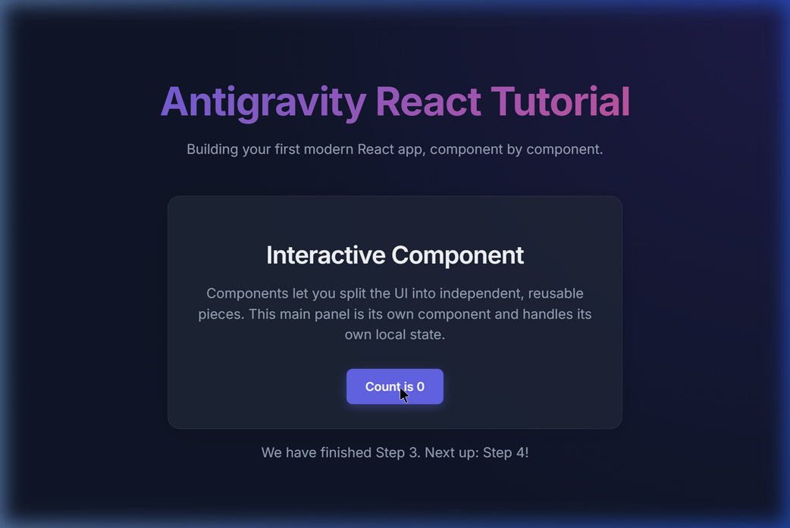
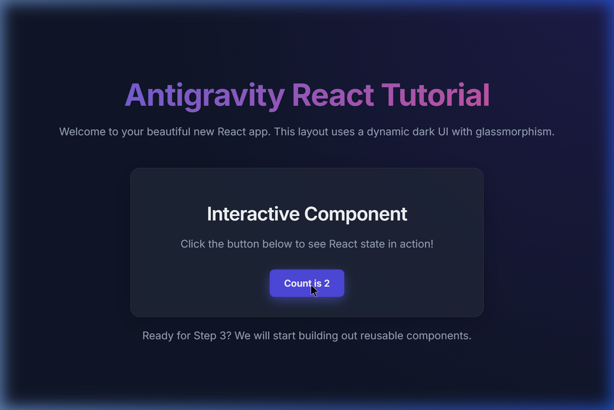
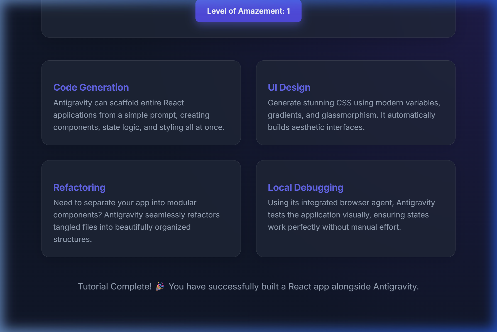

# Project Walkthrough: Antigravity React Tutorial

## Step 3: Build the Core Structure

We have successfully rebuilt our beautiful UI by splitting it into independent, reusable React components! This modularity is the core philosophy of React, making the application much easier to read, scale, and maintain.

### What was changed?
- Created `src/components/` directory.
- Created `Header.jsx` to manage the branding and top-level information.
- Created `MainContent.jsx`, which now independently manages its own `useState` Hook for the interactive button. State is isolated to where it is needed.
- Created `Footer.jsx` to handle the final navigation hint.
- Refactored `src/App.jsx` to import and stack these three distinct components, resulting in an incredibly clean parent component file.

### Visual Verification Progress

**Completed Step 3 Component Split**

**Browser Verification**

**Completed Step 2 Design Setup**

**Browser Subagent Recording - Step 2 Review**

## Step 4: Develop the Content

We added the final application content detailing Antigravity features!
- Built `FeatureCard.jsx`, a new reusable component to render topics cleanly.
- Updated `MainContent.jsx` to pass props to the four feature cards dynamically using JavaScript `.map()`.
- Added CSS Grid styling to ensure the cards responsively stack on small screens and spread out on larger displays.
- Finalized the footer confirming the tutorial's completion.

### Final Verification Progress

**Completed Application Structure (Step 4)**

**Final Browser Run Video**

## Tutorial Complete! 🎉

You have successfully built an aesthetic React SPA from scratch, managed components, isolated state, verified designs automatically, and handled local Git version control—all facilitated directly through intelligent pairing. You are fully equipped to build complex systems. Happy coding!
